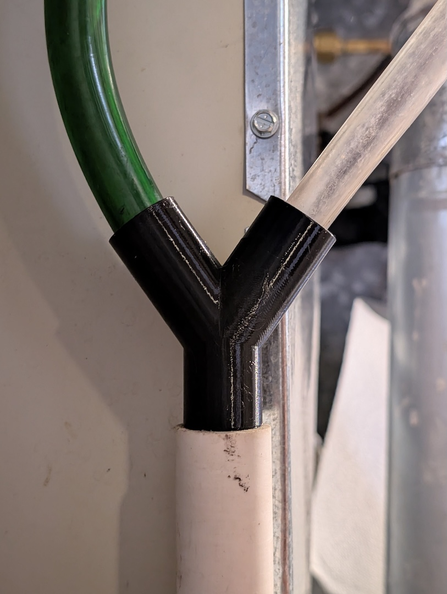
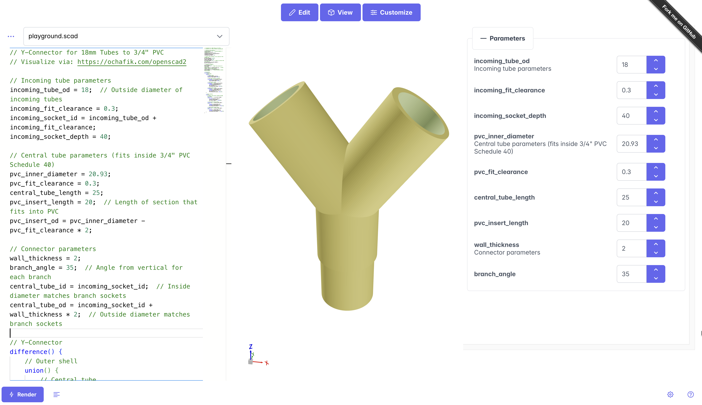

# Customizable 3d Printable Tube Y-Connector

## Overview
This OpenSCAD design creates a 3d-printable Y-connector that can be easily customized to suit different projects.

The file's current settings join two 18mm tubes to an outlet that seats directly into a vertical 3/4" PVC pipe with no adapter. This was designed for simple drainage from a furnace humidifier. It's not meant to be watertight against backup flow.

## Files
* Customizable SCAD file: [y_connector.scad](y_connector.scad)
* Orca / Bambu Studio 3MF file: [y_connector.3mf](y_connector.3mf)

## Customization
You can view and customize this design online without installing OpenSCAD:

**Visit: https://ochafik.com/openscad2**

1. Copy the contents of `y_connector.scad`
2. Paste into the editor at [ochafik.com/openscad2](https://ochafik.com/openscad2)
3. Click on the "Customize" button at the top of the page to customize the parameters as needed
4. Preview the updated design in real-time
5. Click "Render"
6. The button will then change to "Download STL".

### Variables
- `incoming_tube_od`: Outside diameter of incoming tubes (default: 18mm)
- `incoming_socket_depth`: How deep tubes insert into branches (default: 40mm)
- `central_tube_length`: Length of main tube section (default: 25mm)
- `wall_thickness`: Wall thickness throughout (default: 2mm)
- `branch_angle`: Angle of branches from vertical (default: 35°)
- `incoming_fit_clearance`: Clearance for incoming tubes (default: 0.3mm)
- `pvc_inner_diameter`: Size of the PVC tube it will sit in (default: 20.93mm = 3/4" PVC)
- `pvc_insert_length`: Length of PVC insert section (default: 20mm)
- `pvc_fit_clearance`: Clearance for PVC fit (default: 0.3mm)

## 3D Printing
I had to add supports to prevent wobble.

## License
This design is provided as-is for personal and commercial use.
